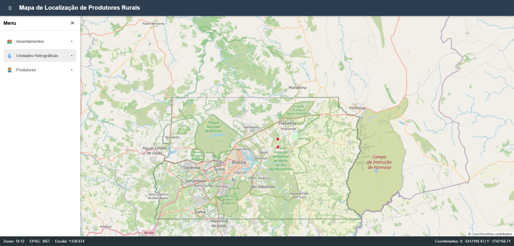
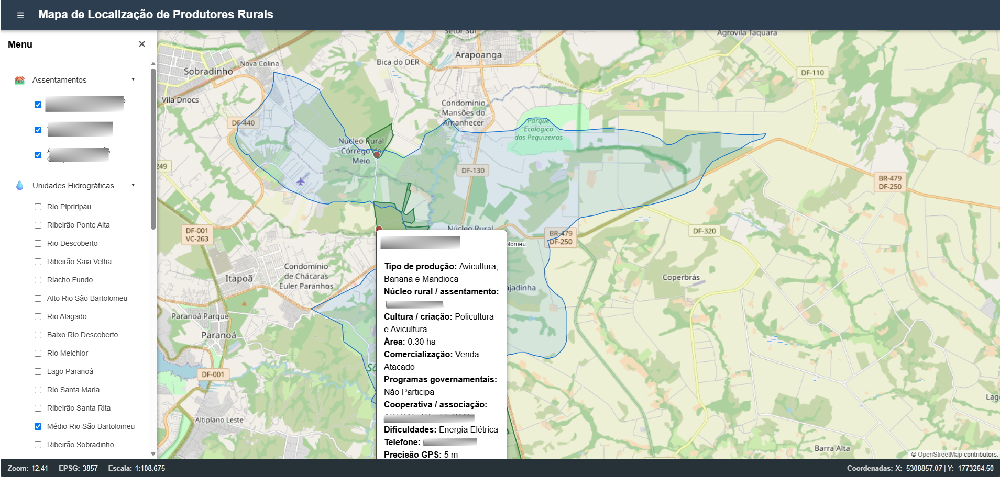
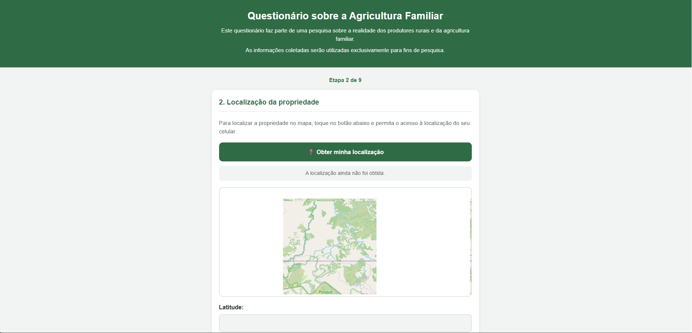

# WebGIS de Cadastro de Produtores Rurais

WebGIS desenvolvido como parte de um projeto de estágio, destinado à integração, visualização e organização de dados geográficos e coleta de informações de forma remota.

O sistema integra uma aplicação web de visualização cartográfica, uma API de backend, um banco de dados espacial PostgreSQL/PostGIS e um formulário para coleta de informações de produtores rurais da reforma agrária.

## Sobre o projeto

O projeto tem como objetivo desenvolver uma plataforma WebGIS para organização e visualização de informações cadastrais relacionadas a produtores rurais.

A aplicação permite integrar diferentes fontes de dados geográficos e informações obtidas em campo e remotamente via formulário de cadastro, possibilitando sua representação espacial em um ambiente web interativo.

Entre as principais funcionalidades previstas estão:

* visualização de camadas geográficas;
* consulta e identificação de elementos espaciais;
* representação de unidades hidrográficas;
* visualização de rótulos e atributos das camadas;
* consulta de informações de produtores;
* coleta de dados por formulário;
* armazenamento de dados espaciais em PostgreSQL/PostGIS;
* disponibilização de informações por meio de uma API;
* integração entre dados geográficos, dados cadastrais e informações de campo.
  







## Arquitetura do sistema

O projeto é organizado em quatro componentes principais:

```text
                           USUÁRIO
                              |
                |---------------------------|
                |                           |
                v                           v
           WEBGIS                        FORMULÁRIO
          frontend/                     formulario/
                |                           |
                |                           v
                |                    Google Apps Script
                |                           |
                |                           v
                |                     Google Sheets
                |
                v
             BACKEND
        backend/server.cjs
                |
                v
               API
       routes/produtores.js
                |
                v
        PostgreSQL/PostGIS
```

## Frontend

O frontend é responsável pela interface gráfica e pela interação do usuário com o WebGIS.

Sua estrutura está organizada em:

```text
|-- src/
|   |-- css/
|   |   |-- style.css
|   |-- js/
|       |-- main.js
|-- index.html
```

O main.js concentra a inicialização e a lógica principal da aplicação, incluindo o carregamento das camadas georáficas e a configuração dos controles de interface. O arquivo index.html fornece a estrutura da página e referencia os scripts e estilos necessários. Já o css/style.css define a aparência visual da aplicação.

## Backend

O backend funciona como camada intermediária entre o frontend e o banco de dados.

```text
|-- backend/
|   |-- dados/
|   |   |-- produtores.json
|-- .env.example
|-- server.cjs
```

O arquivo .env.example contém um modelo de variáveis de ambiente necessárias para rodar o backend.

O servidor é responsável por disponibilizar a API e processar as requisições realizadas pelo frontend.


## Banco de Dados

O projeto utiliza PostgreSQL com a extensão PostGIS para armazenamento e consulta de dados espaciais.

O banco de dados é utilizado pelo backend para persistência e consulta das informações que serão utilizadas no WebGIS.

A documentação da estrutura do banco de dados será organizada na pasta 'docs/' incluindo schemas, tabelas, relacionamentos e campos geométricos utilizando o PostGIS, garantindo a integração consistente com o backend.

## Formulário

O formulário constitui uma interface independente para coleta de informações de campo.

```text
|-- formulario/
|   |-- formulario.js
|   |-- index.html
|   |-- style.css
```

Os dados coletados são encaminhados para o Google Apps Script e registrados em uma planilha Google Sheets, conforme a arquitetura definida para a coleta.

O formulário funciona como uma aplicação cliente executada no navegador. Os dados preenchidos são enviados por meio de uma requisição HTTP ao Web App publicado no Google Apps Script, que processa as informações e as registra em uma planilha Google Sheets.





Posteriormente estas informações serão inseridas ao PostgreSQL/PostGIS para integração com o WebGIS. 


## Estrutura do repositório

```text
webgis-geografia-agraria/
|
|-- README.md
|
|-- frontend/
|   |-- index.html
|   |-- src/
|   |   |-- js/
|   |   |   |-- main.js
|   |   |-- css/
|   |       |-- style.css
|   |-- package.json
|
|-- backend/
|   |-- dados/
|   |   |-- produtores.json
|   |-- .env
|   |-- server.cjs
|
|-- formulario/
|   |-- formulario.js
|   |-- index.html
|   |-- style.cs
|
|-- docs/
    |-- arquitetura.md
    |-- banco-de-dados.md
    |-- api.md
```

## Tecnologias

O projeto utiliza tecnologias de desenvolvimento web e geoprocessamento, incluindo:

HTML5;
CSS3;
JavaScript;
Openlayers;
Leaflet;
Node.js;
API REST;
PostgreSQL;
PostGIS;
GeoServer; 
Google Apps Script;
Google Sheets;
Git;
GitHub.

## Fluxo de dados

## Visualização no WebGIS

```text
PostgreSQL/PostGIS
        |
        v
     Backend
        |
        v
       API
        |
        v
    JavaScript
        |
        v
     OpenLayers
        |
        v
     Usuário
```

## Coleta de informações:

```text
Produtor rural
      |
      v
Formulário Web
      |
      v
Google Apps Script
      |
      v
Google Sheets
```

## Documentação

A documentação técnica detalhada está organizada na pasta docs/.

Documento	Conteúdo
docs/arquitetura.md	Arquitetura e funcionamento geral do sistema
docs/banco-de-dados.md	Estrutura do PostgreSQL/PostGIS
docs/api.md	Endpoints e funcionamento da API

Instalação e execução

As instruções de instalação e execução serão documentadas conforme cada componente do sistema for finalizado.

De forma geral, a aplicação será executada a partir da seguinte estrutura:

```text
Frontend
   |
   v
Backend / API
   |
   v
PostgreSQL + PostGIS 
```

O formulário possui fluxo independente de publicação e coleta.

## Status do projeto

🚧 Em desenvolvimento

O projeto está sendo desenvolvido de forma incremental. Novas funcionalidades, camadas geográficas, endpoints e componentes da aplicação serão incorporados ao repositório conforme o desenvolvimento avançar.

A licença do projeto será definida posteriormente.


